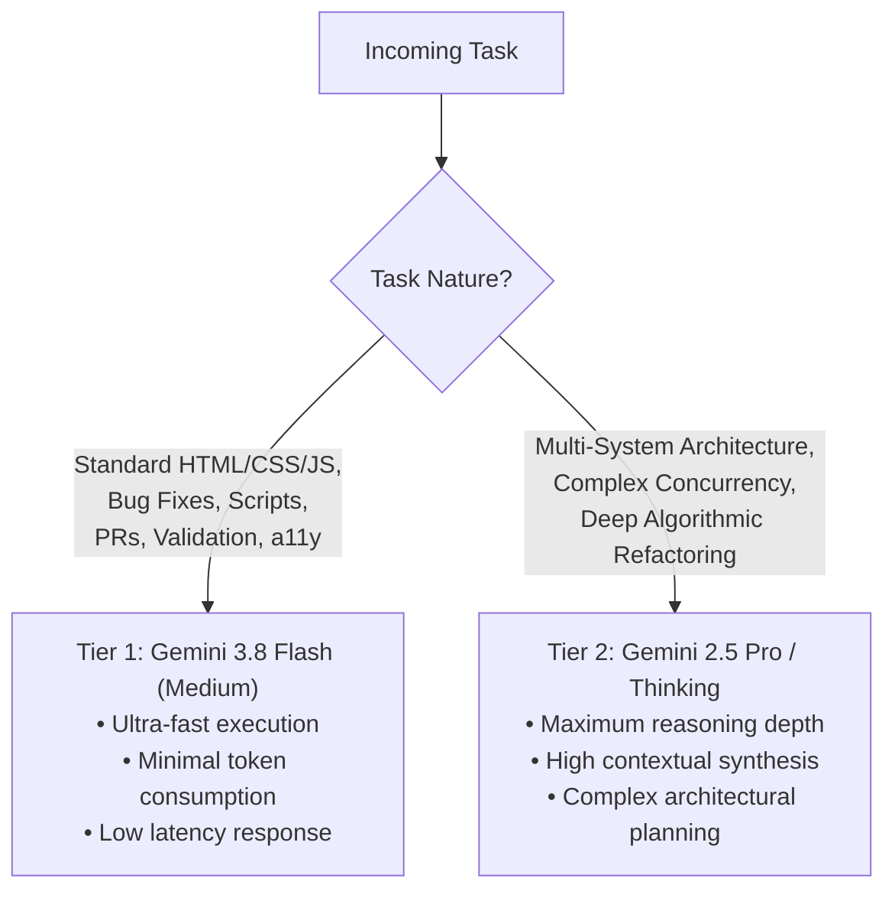

# Model Selection & Task Allocation Framework

## 1. Core Philosophy: The Right Model for Every Task
To balance execution speed, token economy, and reasoning capability, tasks are routed across two distinct model tiers. Always use the most efficient model that reliably accomplishes the task.

---

## 2. Model Tier Matrix

| Tier | Recommended Model | Primary Scope & Workflows | Token & Latency Profile |
| :--- | :--- | :--- | :--- |
| **Tier 1: Workhorse (Default)** | **Gemini 3.8 Flash (Medium)** | • HTML5 semantic development & landmark structuring • CSS design token updates & responsive layouts • Vanilla JS event handlers, DOM safety, form validation • Running local tests, validation scripts & linter execution • Git branch management, commits & PR drafting • SEO metadata, Schema.org updates, a11y audits | • **Ultra-Low Latency** • **Minimal Token Cost** • **Highest Throughput** |
| **Tier 2: Escalation (Deep Reasoning)** | **Gemini 2.5 Pro / Thinking Models** | • System-wide architectural migrations & re-platforming • Complex concurrency & distributed state engines • High-ambiguity initial project planning & security threat modeling • Subtle race condition debugging & complex mathematical models | • High reasoning depth • Extended thinking budget • Selective invocation |

---

## 3. Allocation Rules & Invariants
1. **Default to Tier 1:** All standard web development tasks (HTML, CSS, JavaScript, Git, CI scripts, quality gates) default to **Gemini 3.8 Flash (Medium)**.
2. **Escalation Protocol:** Only escalate to Tier 2 if a task presents severe architectural ambiguity, multi-system architectural conflicts, or requires deep algorithmic proofs.
3. **De-escalation:** Once an architectural plan is established by a deep reasoning model, switch back to Tier 1 for rapid, token-efficient implementation and validation.
4. **Token Preservation:** Never use heavy reasoning models for routine file edits, formatting, or command execution.
