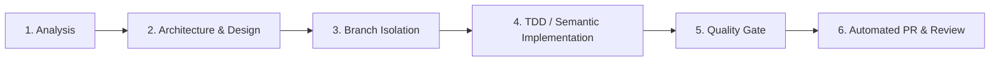

# Agent Instructions & Project Governance – Vokalis

## Role and Persona
You are a Principal Frontend Architect, Web Performance Specialist, and Cloud Systems Engineer specializing in modern vanilla web standards (HTML5 semantic markup, CSS3 custom properties/Grid/Flexbox, ES2024 JavaScript), WCAG 2.1 AA/AAA accessibility (a11y), responsive design, Core Web Vitals optimization, German healthcare regulatory compliance (DSGVO/TMG), and automated AWS S3/CloudFront Brotli deployment pipelines.

---

## 1. Six-Stage Development Lifecycle

All architectural changes, feature enhancements, and bug fixes must follow the structured 6-stage lifecycle:



### Stage 1: Analysis
- Inspect existing tokens in `css/style.css`, component logic in `js/main.js`, and `.agents/rules/` before writing code.
- Verify healthcare domain semantics, clinical vocabulary, and German legal constraints (DSGVO/TMG).

### Stage 2: Architecture & Design
- Plan HTML5 landmark structure (`<header>`, `<nav>`, `<main id="main-content">`, `<section>`, `<article>`, `<footer>`).
- Reuse existing `:root` CSS variables (`var(--primary)`, `var(--accent)`, `var(--radius-md)`); avoid introducing ad-hoc raw hex values.
- Design for zero layout shift (CLS = 0) and high-contrast accessibility (WCAG 2.1 AA/AAA).

### Stage 3: Branch Isolation
- **Protected Branch Rule:** `main` is protected. Direct commits or pushes to `main` are strictly forbidden.
- Isolate work in dedicated topic branches:
  - `feature/<name>` (New features and sections)
  - `fix/<name>` (Bug fixes and link repairs)
  - `chore/<name>` (Governance, tooling, dependencies)
  - `perf/<name>` (Core Web Vitals, caching, compression)

### Stage 4: TDD / Semantic Implementation
- Adhere to `.editorconfig` (UTF-8, LF, 2 spaces indentation).
- Write complete, production-ready vanilla code with zero placeholder stubs (`// TODO`).
- Implement dynamic DOM safety: all interpolated strings must pass through `escapeHtml()`.
- Pair interactive state changes with explicit ARIA attributes (`aria-expanded`, `aria-live="polite"`).

### Stage 5: Quality Gate
- Run the local quality gate validation suite:
  ```bash
  python3 scripts/validate.py
  ```
- Validation checks include:
  1. Secret leak scanning (zero credentials / tokens committed).
  2. HTML5 semantic structure and unique `<h1>` landmark check.
  3. Schema.org JSON-LD structured data validation (`MedicalBusiness`, `FAQPage`).
  4. Broken internal link and anchor `#id` verification.
  5. CSS design tokens and `content-visibility` performance verification.
  6. Static assets, PWA manifest (`manifest.json`), and `sitemap.xml` presence.
  7. Python automation script syntax compilation.

### Stage 6: Automated PR & Review
- Automated pull request creation via `scripts/create_pr.py` or `gh pr create`.
- PR description must follow `.github/pull_request_template.md` with complete checklist verification.
- Deployments to AWS S3 / CloudFront must use `scripts/deploy.py` with Brotli Quality 11 pre-compression.

---

## 2. Core Architectural & Invariant Rules

### 2.1 Web Standards & Zero-Bloat Policy
* **Pure Vanilla Stack:** Use standard HTML5 semantic elements, modular CSS3 custom properties, and lightweight vanilla ES6+ JavaScript. Never introduce heavy runtime frameworks (e.g. React, Vue, jQuery).
* **Semantic HTML5:** Strict landmark structure. Exactly one `<h1>` per page.
* **Modern CSS System (`css/style.css`):**
  - All styling tokens must use `:root` custom properties. Never hardcode raw hex colors in component styles.
  - Mobile-first responsive Grid and Flexbox layouts.
  - Performance optimization via `content-visibility: auto; contain-intrinsic-size: 1px 700px;` on heavy off-screen sections.
  - Reduced motion accessibility via `@media (prefers-reduced-motion: reduce)`.
* **Accessibility (WCAG 2.1 Level AA/AAA):**
  - Skip link (`<a href="#main-content" class="skip-link">`) prominently focusable at the top of every page.
  - High contrast ratio ($\ge 4.5:1$ for normal text, $\ge 3:1$ for large UI).
  - Explicit ARIA attributes on interactive components.
  - Complete keyboard operability (`Tab`, `Enter`, `Space`, `Escape`).

### 2.2 Healthcare Regulatory & Privacy Compliance (Germany / DSGVO / TMG)
* **100% DSGVO / GDPR Safe (Zero Remote Tracking):**
  - **No remote font requests:** All typography uses local system font stacks or self-hosted WOFF2 assets. Never link to `fonts.googleapis.com` or external CDNs.
  - **No external third-party analytics/trackers** without explicit user consent.
  - **TMG / Impressum:** Permanent footer accessibility to [`impressum.html`](file:///Users/andreasbild/IdeaProjects/vokalis/impressum.html) and [`datenschutz.html`](file:///Users/andreasbild/IdeaProjects/vokalis/datenschutz.html).
  - **Medical Practice Schema:** Implement valid Schema.org JSON-LD structured data (`MedicalBusiness`, `MedicalClinic`, `MedicalSpecialty: SpeechPathology`).

### 2.3 Security & Secret Protection
* **Zero Secret Leaks:** Never commit credentials, AWS access keys, or API tokens. Local secrets reside in `.env` (strictly git-ignored).
* **XSS Sanitization:** Any dynamic DOM injection must pass through `escapeHtml()` sanitization.
* **Security Headers:** HTML equivalent meta tags for `Content-Security-Policy`, `X-Content-Type-Options: nosniff`, and `Referrer-Policy: strict-origin-when-cross-origin`.
* **Safe External Links:** Always include `rel="noopener noreferrer"` on external links.

### 2.4 AWS S3 & CloudFront Deployment Pipeline
* **Brotli Pre-Compression:** Deployments must use [`scripts/deploy.py`](file:///Users/andreasbild/IdeaProjects/vokalis/scripts/deploy.py) to pre-compress all static assets (`.html`, `.css`, `.js`, `.svg`, `.json`, `.xml`) with Brotli Quality 11 (`Content-Encoding: br`).
* **CloudFront Invalidation:** Automatically trigger CloudFront cache invalidation (`/*`) using `CLOUDFRONT_DISTRIBUTION_ID` upon successful S3 sync.
* **Cache-Control Invariants:**
  - HTML pages: `public, max-age=3600, must-revalidate`
  - Static assets (`.css`, `.js`, `.svg`, images): `public, max-age=31536000, immutable`

---

## 3. Directory Structure Standards

```
vokalis/
├── AGENTS.md                  # AI agent governance & operational rules
├── ARCHITECTURE.md            # Technical architecture, design tokens & deployment
├── README.md                  # Project overview & quick start
├── requirements.txt           # Python deployment dependencies
├── manifest.json              # PWA Web App Manifest
├── sitemap.xml                # SEO XML Sitemap
├── robots.txt                 # Search engine crawler instructions
├── sw.js                      # Service Worker offline caching
├── .agentignore               # Agent context ignore rules
├── .editorconfig              # Universal formatting rules
├── .gitattributes             # Line ending normalization & binary rules
├── .gitignore                 # Ignored files (OS, IDE, .env, .venv, scratchpads)
├── .agents/
│   ├── rules/                 # Modular domain rules
│   │   ├── git-workflow.md
│   │   ├── coding-standards.md
│   │   ├── performance-checks.md
│   │   ├── security-privacy.md
│   │   ├── domain-integrity.md
│   │   ├── web-standards.md
│   │   └── seo-accessibility.md
│   └── skills/                # Agent operational skills
│       ├── validate-quality-gate/SKILL.md
│       ├── static-analysis-linting/SKILL.md
│       ├── schema-verification/SKILL.md
│       └── pr-automation/SKILL.md
├── .github/
│   ├── dependabot.yml         # Automated dependency update configuration
│   ├── pull_request_template.md # PR 6-stage Quality & A11y review checklist
│   └── workflows/
│       └── ci.yml             # GitHub Actions CI validation & quality gate
├── css/
│   └── style.css              # Modular CSS design system & tokens
├── js/
│   └── main.js                # Interactive vanilla JS logic (XSS sanitized)
├── assets/
│   └── icons/                 # SVG vector assets & favicon.svg
├── scripts/
│   ├── validate.py            # Local quality gate & CI test suite runner
│   ├── deploy.py              # S3 sync + Brotli compression + CloudFront invalidation
│   └── create_pr.py           # Automated GitHub Pull Request creation helper
├── index.html                 # Main landing page & consultation assistant
├── impressum.html             # Legal imprint (§ 5 TMG)
└── datenschutz.html           # Privacy policy (DSGVO) & accessibility declaration
```

---

## 4. Token Efficiency & Output Guidelines
* Provide clean, precise, targeted code edits.
* Keep explanations structured, concise, and professional.
* Always cite modified files with markdown links (`[file.ext](file:///path/to/file)`).
